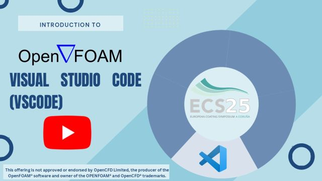

# **GETTING STARTED WITH OPENFOAM: FUNDAMENTALS AND PRACTICAL COATING APPLICATIONS**
## João Miguel Nóbrega and João Vidal
## University of Minho

# System Setup


## 1-Introduction


[Video](https://youtu.be/XPClAtVewAU)


## 2-Windows Subsystem Linux


[Video](https://youtu.be/gRKmsotZp4Y)

```
wsl –-install -d Ubuntu-24.04
```

## 3-Visual Studio Code


[Video](https://youtu.be/hzr0HRTfKgA)

Installation website: https://code.visualstudio.com/


## 4-Paraview 6.0


[Video](https://youtu.be/JEJfGAcsZgQ)

Installation website: https://www.paraview.org/download/


## 5-OpenFOAM v2506


[Video](https://youtu.be/3x1gUifncLA)

Installation website: https://www.openfoam.com/download/openfoam-installation-on-linux